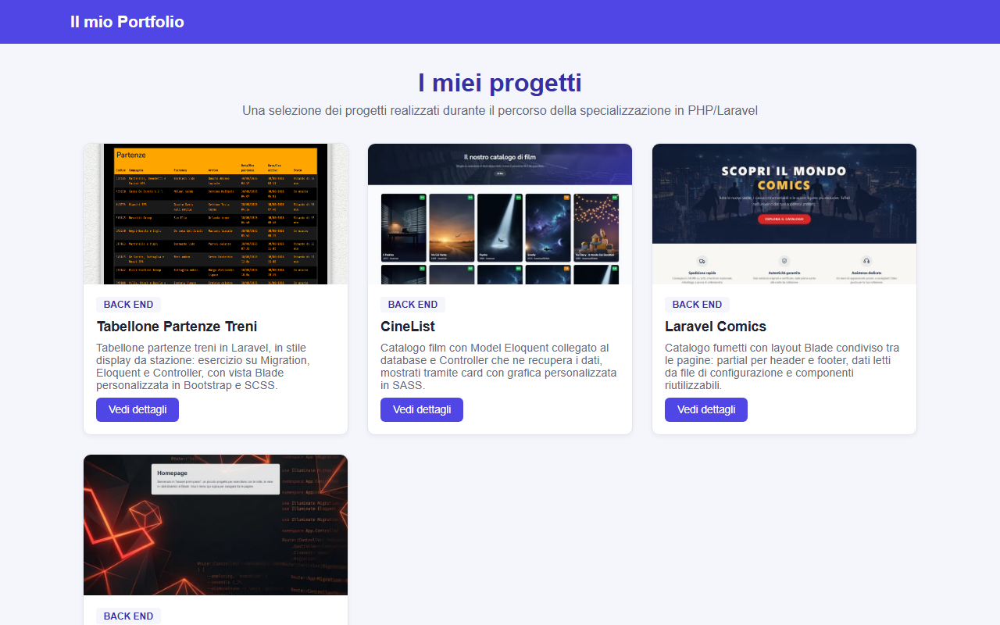
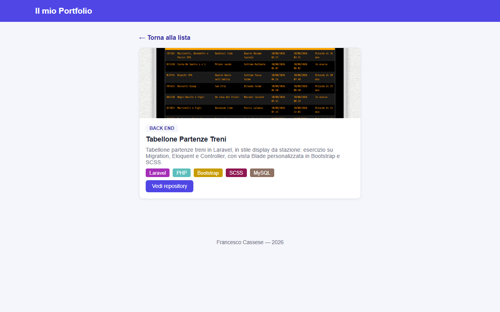

# 🖼️ Laravel Portfolio Bonus — Frontend React per API Laravel

Applicazione frontend in React (Vite) che consuma le API JSON esposte da [laravel-portfolio](https://github.com/francesco-cassese/laravel-portfolio): un utente non autenticato può consultare l'elenco dei progetti del portfolio in Home e visualizzarne il dettaglio in una pagina dedicata. Esercizio bonus della specializzazione PHP/Laravel: nessuna vista Blade coinvolta, solo consumo di API REST da parte di un client esterno, con configurazione CORS lato Laravel per autorizzare le chiamate.

## ✨ Funzionalità

- Home page pubblica con la griglia dei progetti, recuperati da `GET /api/projects`
- Pagina di dettaglio progetto (`/projects/:id`) con recupero dei dati da `GET /api/projects/{project}`, comprensiva di tipologia e badge colorati delle tecnologie utilizzate
- Routing client-side con **React Router**
- Componente `ProjectCard` riutilizzabile sia nella lista (link interno al dettaglio) sia nella pagina di dettaglio (link esterno al repository, prop `detailed`)
- Hook `useFetch` per centralizzare chiamata API, stato di caricamento ed errore
- Gestione degli stati di caricamento ed errore in entrambe le pagine
- Stile scoped tramite **CSS Modules**, uno per componente/pagina, con variabili di colore condivise in `index.css`

## 📸 Screenshot




## 🎯 Obiettivi dell'esercizio

La traccia dell'esercizio richiedeva, sul lato backend Laravel (repo [laravel-portfolio](https://github.com/francesco-cassese/laravel-portfolio)):

- Preparare delle API a cui un'app esterna possa agganciarsi per ricevere informazioni sui progetti.
- Pubblicare il file `routes/api.php` col comando `php artisan route:publish api`.
- Creare un controller dedicato alle API dei progetti, col comando `php artisan make:controller Api/ProjectController`, e inserirvi i metodi per restituire l'elenco dei progetti ed un singolo progetto in formato JSON.
- Testare su Postman le due rotte per verificare che restituissero correttamente i JSON predisposti.
- Predisporre le configurazioni CORS di Laravel nel file `cors.php` per autorizzare l'applicazione esterna ad effettuare chiamate al backend.

**Bonus** (questo repository, `laravel-portfolio-bonus`):

- Preparare, in un repo a parte, una piccola applicazione frontend con React che permetta ad un utente non loggato di vedere la lista dei progetti in Home e di visualizzare il singolo progetto in una pagina di dettaglio, sfruttando le API prodotte in Laravel.
- Predisporre le configurazioni CORS di Laravel nel file `cors.php` per autorizzare l'applicazione esterna ad effettuare le chiamate al backend.

## 🛠️ Stack tecnico

- React 19 + React Router 7
- Vite 8 come dev server e bundler, gestito con pnpm
- CSS Modules per lo stile scoped, senza framework CSS
- Laravel (repo separato) come backend API, con CORS configurato per accettare le chiamate da questo frontend

## 📁 Struttura del progetto

```
laravel-portfolio-bonus/
├── src/
│   ├── components/
│   │   ├── Header.jsx / Header.module.css        # Intestazione con link alla Home
│   │   ├── Footer.jsx / Footer.module.css         # Footer con autore e anno
│   │   └── ProjectCard.jsx / ProjectCard.module.css # Card progetto riutilizzabile (lista + dettaglio)
│   ├── hooks/
│   │   └── useFetch.js                            # Hook generico per fetch + stato loading/error
│   ├── pages/
│   │   ├── Homepage.jsx / Homepage.module.css      # Home con griglia progetti
│   │   └── ProjectDetail.jsx / ProjectDetail.module.css # Dettaglio del singolo progetto
│   ├── services/
│   │   └── api.js                                  # BASE_URL e funzione fetchApi condivisa
│   ├── App.jsx                                     # Definizione delle rotte (Home, dettaglio)
│   ├── main.jsx                                     # Entry point React
│   └── index.css                                    # Reset globale e variabili di colore
├── docs/                                             # Screenshot per il README
├── .env                                              # VITE_API_URL del backend Laravel
└── README.md
```

## 🚀 Come avviare il progetto

### Requisiti

- Node.js con pnpm
- Il backend [laravel-portfolio](https://github.com/francesco-cassese/laravel-portfolio) avviato e raggiungibile (di default su `http://127.0.0.1:8000`), con `config/cors.php` configurato per autorizzare l'origine di questo frontend (es. `http://localhost:5173`)

### Setup

Clona il progetto:

```bash
git clone https://github.com/francesco-cassese/laravel-portfolio-bonus.git
cd laravel-portfolio-bonus
```

Installa le dipendenze:

```bash
pnpm install
```

Configura l'URL del backend nel file `.env`:

```
VITE_API_URL=http://127.0.0.1:8000
```

Avvia il dev server:

```bash
pnpm dev
```

Visita l'URL mostrato in console (di default [http://localhost:5173](http://localhost:5173)) per vedere la lista dei progetti; assicurati che il backend Laravel sia già avviato con `php artisan serve` e che l'origine del frontend sia autorizzata in `config/cors.php`.

## 🔎 Come funziona

- `src/services/api.js` espone `BASE_URL` (letto da `VITE_API_URL`, con fallback a `http://127.0.0.1:8000`) e `fetchApi(endpoint)`, che esegue la `fetch` verso il backend Laravel e solleva un errore se la risposta non è `ok`.
- `src/hooks/useFetch.js` è un hook generico che, dato un endpoint, richiama `fetchApi`, gestisce gli stati `data`, `isLoading` ed `error` e rilancia la richiesta ogni volta che l'endpoint cambia (usato per l'`id` del progetto nel dettaglio).
- `src/pages/Homepage.jsx` chiama `useFetch('/api/projects')` e renderizza una `ProjectCard` per ciascun progetto ricevuto, con stati di caricamento ed errore gestiti a schermo.
- `src/pages/ProjectDetail.jsx` legge l'`id` dalla rotta (`useParams`) tramite React Router, chiama `useFetch('/api/projects/:id')` e riusa lo stesso componente `ProjectCard` in modalità `detailed`, che in questa modalità mostra anche i badge delle tecnologie (colorati dinamicamente in base al campo `color` restituito dall'API) e il link esterno al repository.
- `src/App.jsx` definisce le rotte con `react-router-dom`: `/` per la Home e `/projects/:id` per il dettaglio, con `Header` e `Footer` condivisi tra le pagine.
- Lo stile è organizzato con **CSS Modules**: ogni componente/pagina ha il proprio `*.module.css` con classi scoped in camelCase, mentre `index.css` contiene solo reset e variabili di colore globali condivise.

## 👤 Autore

Francesco Cassese
